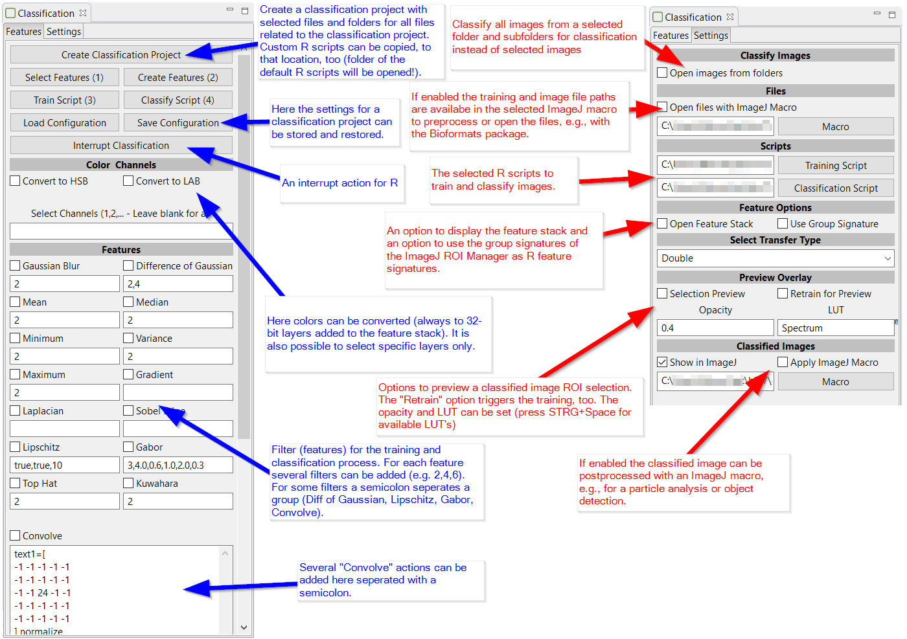

# Bio7 Classification

### A repository for a Bio7 Graphical User Interface for supervised and unsupervised classification which can be extended easily.

## Start

The classification plugin and dependencies are shipped with Bio7 3.2.
The plugin can be started in the R-Shell view context menu ("Image Classification->Main").

You can also use this repository (with the [Eclipse EGit plugin](https://marketplace.eclipse.org/content/egit-git-integration-eclipse) - available in the Update Manager of Bio7) 
to download, compile and start the latest version of this plugin.

ImageJ updates are available via an Update Site (Menu: "Help->Install New Software...")
default available in the Update Manager since Bio7 3.2.

At first start the plugin is compiled to Java classfiles (*.class). 
To recompile (updates, changes) just delete all classfiles in the plugin install directory and subdirectories.

## Usage

#### Videos:

First steps:

Classification preview from a selection:

### Documentation:

##### Features Tab:

With the "Create Classification Project" wizard action a classification Bio7 project can be created with an optional folder structure.
The default R templates can be copied to the new project location for custom scripts (paths have to be adjusted and stored in a configuration file - see below!).

Open an image in ImageJ and follow Button 1-4 for a classification workflow which trains and classifies images with R (scripts
are available in the R directory) in a non-blocking job. For an unsupervised classification (e.g., k-means) just use the classification action (4).

RGB images can be converted to a different color space (see option HSB Stack, LAB Stack) and selected channels from multichannel images
or stacks can be extracted individually.

Several features can be enabled in the default tab which will be added to the default image layers. 
A comma separated text argument adds filter images of different radius or applies special settings for edge algorithms like Difference of Gaussian, Lipschitz, Gabor, Convolve. 
For some edge detection methods a ';' separator can be set, too, for different sets of edge settings (Difference of Gaussian, Lipschitz, Gabor, Convolve) resulting
in one image layer each.
 
All settings for classification can be stored or reopened with the 'Load/Save Configuration' actions in a simple text file (simply drag the file on the GUI interface to load it!).

##### Settings Tab:

In the Settings tab the path to the R (training and classification) and the ImageJ import macro scripts can be set if necessary (or easier simply change the default scripts).
It is also possible to enable a directory dialog (see option 'Use Directory Dialog') for the classification (step 4) of images in a folder and it's subfolders (lists the image files recursively) 
instead of using selected images with the file dialog (for multiple files).

In addition the data transfer type to R can be selected (whereat most filters require a double transfer - this action will set the transfer type of images, too).
It is also possible to open the default hidden feature stack which will be transfered to R (option 'Open Feature Stack')
and transfer signatures according to the group membership of the ROI (option 'Use Group Signature').

If the 'Selection Preview (Train)' option is enabled a classification overlay will be generated on top of the source image with size and location
of the selection. A retraining of the dataset for the preview can be enabled if the 'Retrain for Preview' option is selected. The ROI overlay will be updated
dynamically if you change or move the ROI selection. Please disable the preview option (a ROI listener) or close the GUI if you recompile the plugin!
The preferred LUT and opacity can be selected, too.

The enabled option "Show in ImageJ" transfers the data back to ImageJ and can be disabled if the classification result should be stored with the R scripts.

With the option "Apply ImageJ Macro" the classified image can be post-processed with an ImageJ macro, e.g., to extract and measure particles or identify image objects.

##### Supported Images:

Until now Multichannel images (e.g. RGB) and Grayscale images or stacks (8-bit, 16-bit, 32-bit) can be classified. It is also possible
to import images with an ImageJ macro (e.g. Landsat 8 images, see ImageJ macro example!).

##### Note:

For convenience images and stored ROI Manager files can be dropped on the ImageJ-Canvas view to open them. In addition a saved R workspace file can be opened, too, by
dropping it on the main toolbar of Bio7. Finally a stored GUI configuration file can be opened by dropping it directly on the classification GUI.

## Development

You can download, change and customize the source with GIT.

To compile the plugin open the 'Main.java' class and compile it dynamically (use the 'Compile Java' action in the Bio7 main toolbar). The dependent classes will be compiled, too.

The 'ModelGui' SWT graphical view interface can be modified or extended with the [Eclipse WindowBuilder plugin](https://marketplace.eclipse.org/content/windowbuilder) (SWT) if installed in Bio7.
The Main.java class can be extended with further filters or default features. 

The default R scripts and the ImageJ import macro can be changed with the R and ImageJ macro Bio7 editors.

## RAM Usage Settings for Big Images
 
#### Rserve:

If I want to transfer a huge image to R the following warning message about buffer size occurs: "WARNING: discarding buffer because too big awaiting.."

Solution: Increase the size of the input buffer in the Rserve preferences. Open the Rserve preferences Preferences->Preferences Bio7->Preferences R.
In the Field "Rserve startup arguments" copy the following startup argument:

maxinbuf="4194304"

The max. packet size from the client to Rserve is set to 4GB in this example (maxinbuf argument in kb). 
Use the example size only if necessary and if you have the memory available!

#### Java:

The Java runtime is able to optimize memory on demand and return occupied memory to the OS. After the transfer to R the image data on the Java
side in the classification process (open and transfer to R) by default is closed. If the memory settings of Java in Bio7 (see Bio7.ini file) are adjusted accordingly most
of the memory can be returned to the OS and thus to R and the memory intensive classification process.

#### Windows and Linux:

For an increased Java heap space open the Bio7.ini file in the install directory of Bio7. In the file you can change the default memory settings e.g. 
the initial heap size -Xms and the maximum heap space -Xmx.

#### MacOSX:

For an increased Java heap space open the Bio7 package (context menu if you click on the icon) then go to Contents->MacOS and open the Bio7.ini file 
with a texteditor. In the file you can change the default memory settings e.g. the initial heap size -Xms and the maximum heap space -Xmx.

Example:

For instance to be able to return back much memory after image transfer use a low -Xms setting (e.g.: -Xms1024m). The maximum size for the Java Runtime (-Xmx) depends on the image size
and could be adjusted depending on the available RAM (using for instance the half of the available RAM) of the OS.

#### Image Transfer And Classification Data:

In the Settings tab the datatype from Java to R can be adjusted for a less memory consumption if possible (whereat most filters require a double transfer - transfer and classification - options are: double, integer, raw).

#### Using the Bioformats library:

Using the Bio-Formats library with the ImageJ macro (enable the option 'Use ImageJ Macro at Import' in the 'Settings' tab) it is possible to crop huge images to parts before the R classification process starts.
The library has to be installed first as an ImageJ plugin.
Bio-Formats GUI import commands can be recorded with the ImageJ macro recorder for use in the available project macro for, e.g., a specific import.
If the library is used the loaded image is opened by default (can't be avoided in a macro - simply close the image after display).

## External Java Libraries

The plugin uses at the moment two external Java libraries:

[BoofCV](https://boofcv.org)

[Catalano-Framework](https://github.com/DiegoCatalano/Catalano-Framework)

